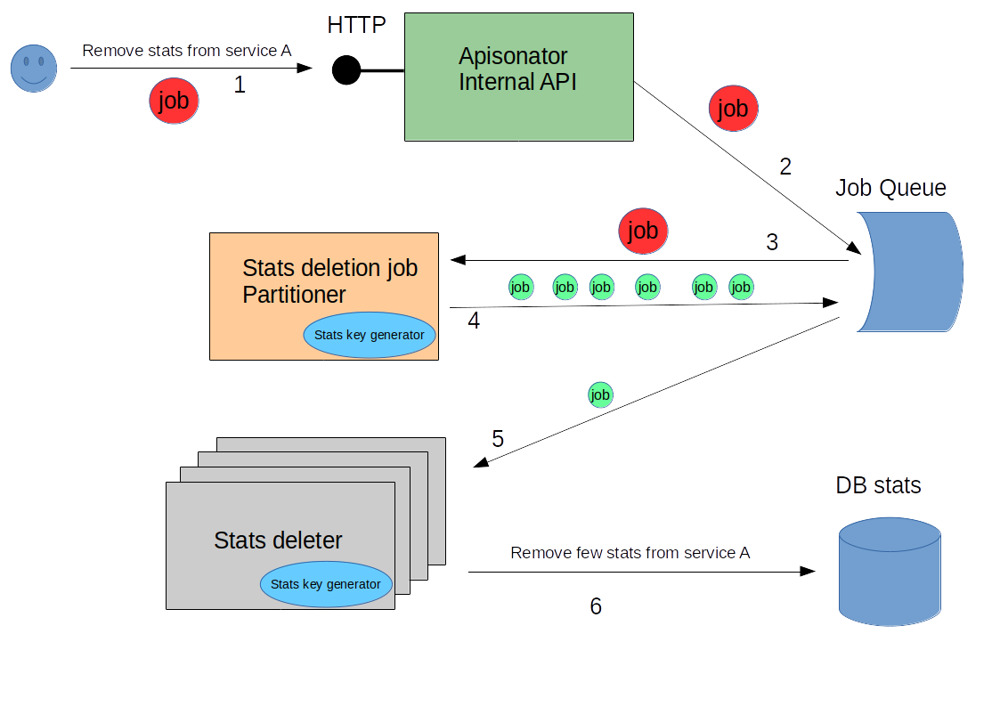

# Given a Service, delete all its Stats

The number of stats from a given service A can be huge.
It is roughly estimated that there are 300K keys of stats per metric, application, user and year.
Deleting all stat keys at once is not a good idea.

The following diagram shows high level overview of the workflow being executed to delete all stats 
for a given service.

