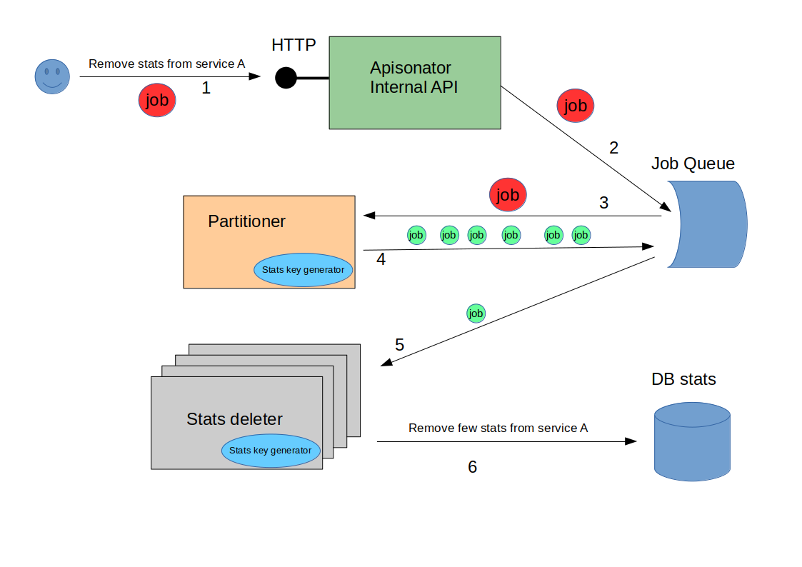

# Given a Service, delete all its Stats

The number of stats from a given service A can be huge.
It is roughly estimated that there are 300K keys of stats per metric, application, user and year.
Deleting all stat keys at once is not a good idea.

The following diagram shows high level overview of the workflow being executed to delete all stats
for a given service.



Steps shown in the diagram are:

1. Using internal API, client starts workflow. API endpoint requires, besides some service metadata,
the list of metrics, applications, users and a time period *[from, to]*. Having this interface,
API allows partitioning at API level.
A client call this api sequentially with different subset of applications.
1. Internal API will enqueue the job. All stats deletion workflow happens offline.
1. A worker called *Partitioner* receives stats deletion job description.
It's job is to divide the long list of stats keys into sublists of not overlapped stats key set.
1. Each (small) sublist will be wrapped as a small job and enqueued for further processing by other worker.
1. A worker called *Stats Deleter* receives one of those jobs containing small sublist of stats key
1. Perform actual stats deletion operation on database in batches of keys.

Some features of the designed workflow:

* Jobs for stats deletion will be enqueued into low priority queues.
The idea is to minimize db impact and there is no rush deleting stats.
* The (small) jobs received by *Stats Deleter* are measured in number of keys.
Limiting jobs in number of keys allows measurable expected impact in db, no matter what.
DB delete operations occur in batches.
* *Partitioner* and *Stats Deleter* configuration must be designed with two goals:
  * small number of delete operations by *Stats Deleter* -> Allows worker to finish quickly the job
  and start another, probably with higher priority, job. Besides, in case of failure,
  the job to be re-done is minimized.
  * Small number of batch size per each delete operation -> Minimizes db load and allows high response times.
* Having responsive and low response times by design, that might lead to the generation of lots of stats delete jobs.
Should not be an issue.

Running this particular *Partitioner*, it will not generate small jobs, but send them to *stdout* as json.

```ruby
$ cat main_partitioner.rb
require 'ostruct'
require_relative('job')
require_relative('stats_key_partition_generator')
require_relative('stats_key_generator')

job = StatsRemovalJob.new(
  applications: [1],
  metrics: [10],
  service_id: 100,
  from: Time.new(2017, 1, 1, 1),
  to: Time.new(2017, 4, 5, 1)
)

stats_key_gen = StatsKeyGenerator.index_generator(job)

PartitionGenerator.partitions(stats_key_gen).each do |from, to|
  # generate resque job
  puts "from: #{from.to_json}"
  puts "to: #{to.to_json}"
end

$ ruby main_partitioner.rb
from: {"key_type":0,"metric":0,"app":null,"user":null,"granularity":0,"ts":0}
to: {"key_type":0,"metric":0,"app":null,"user":null,"granularity":4,"ts":1486411200}
from: {"key_type":0,"metric":0,"app":null,"user":null,"granularity":4,"ts":1486414800}
to: {"key_type":0,"metric":0,"app":null,"user":null,"granularity":4,"ts":1490011200}
from: {"key_type":0,"metric":0,"app":null,"user":null,"granularity":4,"ts":1490014800}
to: {"key_type":1,"metric":0,"app":0,"user":null,"granularity":4,"ts":1485075600}
from: {"key_type":1,"metric":0,"app":0,"user":null,"granularity":4,"ts":1485079200}
to: {"key_type":1,"metric":0,"app":0,"user":null,"granularity":4,"ts":1488675600}
from: {"key_type":1,"metric":0,"app":0,"user":null,"granularity":4,"ts":1488679200}
to: {"key_type":1,"metric":0,"app":0,"user":null,"granularity":5,"ts":1483225200}
```

Let's say we try to delete first partition

```json
{"key_type":0,"metric":0,"app":null,"user":null,"granularity":0,"ts":0}
{"key_type":0,"metric":0,"app":null,"user":null,"granularity":4,"ts":1486411200}
```

Running this particular *Stats Deleter* for the given partition,
it will not delete keys from DB, but write keys to *stdout*.
Since this is a PoC, key format is not accurate.

```ruby
$ cat main_partition_eraser.rb
require_relative('job')
require_relative('key_idx')
require_relative('stats_key_generator')

DELETE_BATCH_SIZE = 50

job = StatsRemovalJob.new(
  applications: [1],
  metrics: [10],
  service_id: 100,
  from: Time.new(2017, 1, 1, 1),
  to: Time.new(2017, 4, 5, 1)
)

limits = [
  KeyIndex.parse_json('{"key_type":0,"metric":0,"app":0,"users":null,"granularity":0,"ts":0}'),
  KeyIndex.parse_json('{"key_type":0,"metric":0,"app":0,"users":null,"granularity":4,"ts":1486411200}')
]

stats_key_gen = StatsKeyGenerator.key_generator(job, limits)

# method to get keys and abstract idx and value tuple
stats_key_gen.each_slice(DELETE_BATCH_SIZE) do |slice|
  puts '=== delete batch ===='
  puts slice.inspect
end

$ ruby main_partition_eraser.rb
=== delete batch ====
["/service/100/metric/10/date/eternity", "/service/100/metric/10/date/month:201701", "/service/100/metric/10/date/month:201702", "/service/100/metric/10/date/month:201703", "/service/100/metric/10/date/month:201704", "/service/100/metric/10/date/week:20161226", "/service/100/metric/10/date/week:20170102", "/service/100/metric/10/date/week:20170109", "/service/100/metric/10/date/week:20170116", "/service/100/metric/10/date/week:20170123", "/service/100/metric/10/date/week:20170130", "/service/100/metric/10/date/week:20170206", "/service/100/metric/10/date/week:20170213", "/service/100/metric/10/date/week:20170220", "/service/100/metric/10/date/week:20170227", "/service/100/metric/10/date/week:20170306", "/service/100/metric/10/date/week:20170313", "/service/100/metric/10/date/week:20170320", "/service/100/metric/10/date/week:20170327", "/service/100/metric/10/date/week:20170403", "/service/100/metric/10/date/day:20170101", "/service/100/metric/10/date/day:20170102", "/service/100/metric/10/date/day:20170103", "/service/100/metric/10/date/day:20170104", "/service/100/metric/10/date/day:20170105", "/service/100/metric/10/date/day:20170106", "/service/100/metric/10/date/day:20170107", "/service/100/metric/10/date/day:20170108", "/service/100/metric/10/date/day:20170109", "/service/100/metric/10/date/day:20170110", "/service/100/metric/10/date/day:20170111", "/service/100/metric/10/date/day:20170112", "/service/100/metric/10/date/day:20170113", "/service/100/metric/10/date/day:20170114", "/service/100/metric/10/date/day:20170115", "/service/100/metric/10/date/day:20170116", "/service/100/metric/10/date/day:20170117", "/service/100/metric/10/date/day:20170118", "/service/100/metric/10/date/day:20170119", "/service/100/metric/10/date/day:20170120", "/service/100/metric/10/date/day:20170121", "/service/100/metric/10/date/day:20170122", "/service/100/metric/10/date/day:20170123", "/service/100/metric/10/date/day:20170124", "/service/100/metric/10/date/day:20170125", "/service/100/metric/10/date/day:20170126", "/service/100/metric/10/date/day:20170127", "/service/100/metric/10/date/day:20170128", "/service/100/metric/10/date/day:20170129", "/service/100/metric/10/date/day:20170130"]


...


=== delete batch ====
["/service/100/metric/10/date/hour:2017020420", "/service/100/metric/10/date/hour:2017020421", "/service/100/metric/10/date/hour:2017020422", "/service/100/metric/10/date/hour:2017020423", "/service/100/metric/10/date/hour:2017020500", "/service/100/metric/10/date/hour:2017020501", "/service/100/metric/10/date/hour:2017020502", "/service/100/metric/10/date/hour:2017020503", "/service/100/metric/10/date/hour:2017020504", "/service/100/metric/10/date/hour:2017020505", "/service/100/metric/10/date/hour:2017020506", "/service/100/metric/10/date/hour:2017020507", "/service/100/metric/10/date/hour:2017020508", "/service/100/metric/10/date/hour:2017020509", "/service/100/metric/10/date/hour:2017020510", "/service/100/metric/10/date/hour:2017020511", "/service/100/metric/10/date/hour:2017020512", "/service/100/metric/10/date/hour:2017020513", "/service/100/metric/10/date/hour:2017020514", "/service/100/metric/10/date/hour:2017020515", "/service/100/metric/10/date/hour:2017020516", "/service/100/metric/10/date/hour:2017020517", "/service/100/metric/10/date/hour:2017020518", "/service/100/metric/10/date/hour:2017020519", "/service/100/metric/10/date/hour:2017020520", "/service/100/metric/10/date/hour:2017020521", "/service/100/metric/10/date/hour:2017020522", "/service/100/metric/10/date/hour:2017020523", "/service/100/metric/10/date/hour:2017020600", "/service/100/metric/10/date/hour:2017020601", "/service/100/metric/10/date/hour:2017020602", "/service/100/metric/10/date/hour:2017020603", "/service/100/metric/10/date/hour:2017020604", "/service/100/metric/10/date/hour:2017020605", "/service/100/metric/10/date/hour:2017020606", "/service/100/metric/10/date/hour:2017020607", "/service/100/metric/10/date/hour:2017020608", "/service/100/metric/10/date/hour:2017020609", "/service/100/metric/10/date/hour:2017020610", "/service/100/metric/10/date/hour:2017020611", "/service/100/metric/10/date/hour:2017020612", "/service/100/metric/10/date/hour:2017020613", "/service/100/metric/10/date/hour:2017020614", "/service/100/metric/10/date/hour:2017020615", "/service/100/metric/10/date/hour:2017020616", "/service/100/metric/10/date/hour:2017020617", "/service/100/metric/10/date/hour:2017020618", "/service/100/metric/10/date/hour:2017020619", "/service/100/metric/10/date/hour:2017020620", "/service/100/metric/10/date/hour:2017020621"]
```

Each batch should have *small* number of keys and the number of batches should be low as well.
